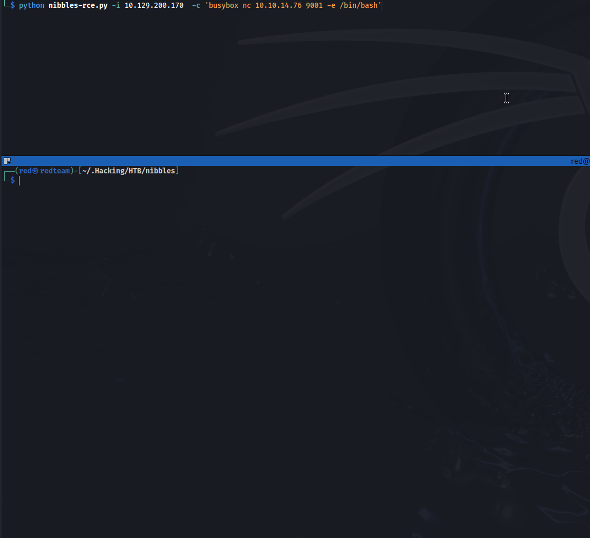
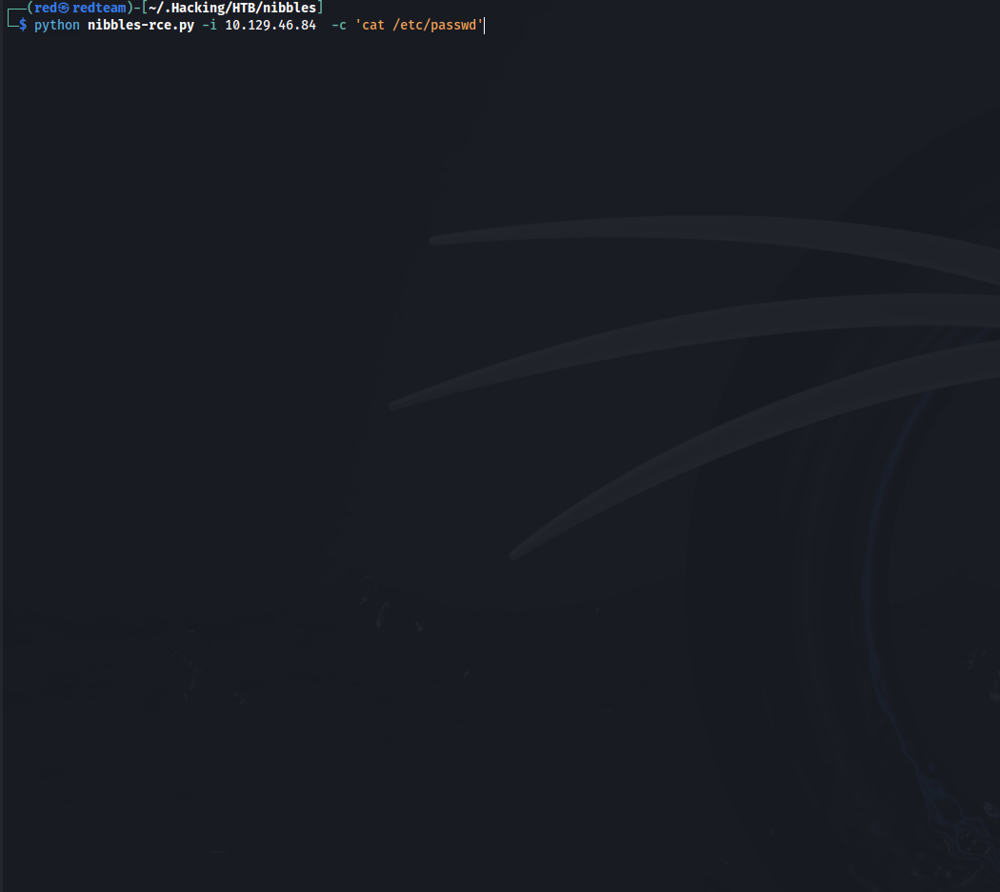

## **Nibbleblog - Python3 RCE Script**

**Overview**

This is my attempt at automating remote code execution on the **Hack The Box** room [Nibbles](https://app.hackthebox.com/machines/Nibbles), as I am making my way through the Pentester Tester Job Role Path. In doing this I hope to retain more of what I am learning as I progress through this path. There is a metasploit module to exploit this much in the same way, but the course say, it is better to understand what s going on under the hood than just blinding executing a metsaploit exploit.

This Python script is designed to automate remote code execution (RCE) via a Nibbleblog platform by exploiting a vulnerability that allows the upload of PHP code through an image upload feature. The script logs into the Nibbleblog admin panel, uploads a PHP file with a custom command embedded within, and then executes the command on the server.

## **Features**

* Automatic Login: Logs into the Nibbleblog admin panel using provided credentials.
* Dynamic Command Execution: Allows the user to specify a shell command that gets executed on the server.
* Response Fetching: Retrieves and displays the output of the executed command from a specific PHP file on the server.
* Colorful Banner: Displays a colorful banner that changes color each time the script is run, enhancing the user interface.
* Graceful Exit: Allows the user to exit the script gracefully using Ctrl+C with a custom message.

---
## **Prerequisites**

Before you can use this script, you need to ensure the following:

* Python 3.x is installed on your machine. 
* Requests and requests_toolbelt Python libraries are installed. 
* These can be installed via pip:

```bash
pip install requests requests_toolbelt colorama
```

* You have valid credentials to access the Nibbleblog admin panel.
* The target Nibbleblog platform is vulnerable to the specific exploit the script is designed to use.

## **Usage**

To use the script, you need to provide it with several command-line arguments detailing the target's IP address, port, the command you wish to execute, and login credentials.

**Command-line Arguments**

* -i, --ip: The IP address of the server where Nibbleblog is hosted.
* -p, --port: The port number where Nibbleblog is accessible (default is 80).
* -c, --command: The command to be executed on the server via the PHP system function.
* -u, --username: The username for Nibbleblog admin login (default is 'admin').
* -pwd, --password: The password for Nibbleblog admin login (default is 'nibbles').

**Example Command**

```bash
python rce.py -i 192.168.1.1 -p 80 -c "cat /etc/passwd" -u admin -pwd nibbles
```

This command will log into the Nibbleblog admin at 192.168.1.1 on port 80, upload a PHP script that executes cat /etc/passwd, and print the output.

## **How It Works**

1. **Login:** The script starts by logging into the Nibbleblog admin using the credentials provided.
2. **Upload and Execute:** It uploads a PHP file crafted to execute the specified shell command. The PHP file is uploaded through an image upload functionality meant for the 'my_image' plugin.
3. **Fetch Output:** After successfully uploading and executing the PHP file, the script fetches the output from image.php, which is expected to display the result of the executed command.
4. **Graceful Exit:** The script can be terminated at any point by pressing Ctrl+C, which triggers a message and a clean exit.

## **Reverse Shell Example**




## Reading `/etc/passwd` file.



## **Important Notes**

* This script is intended for educational purposes or legitimate security testing on platforms where you have authorization to test.
* Misuse of this script can result in significant impacts to affected systems, including but not limited to data loss, data corruption, and service disruption.
---
